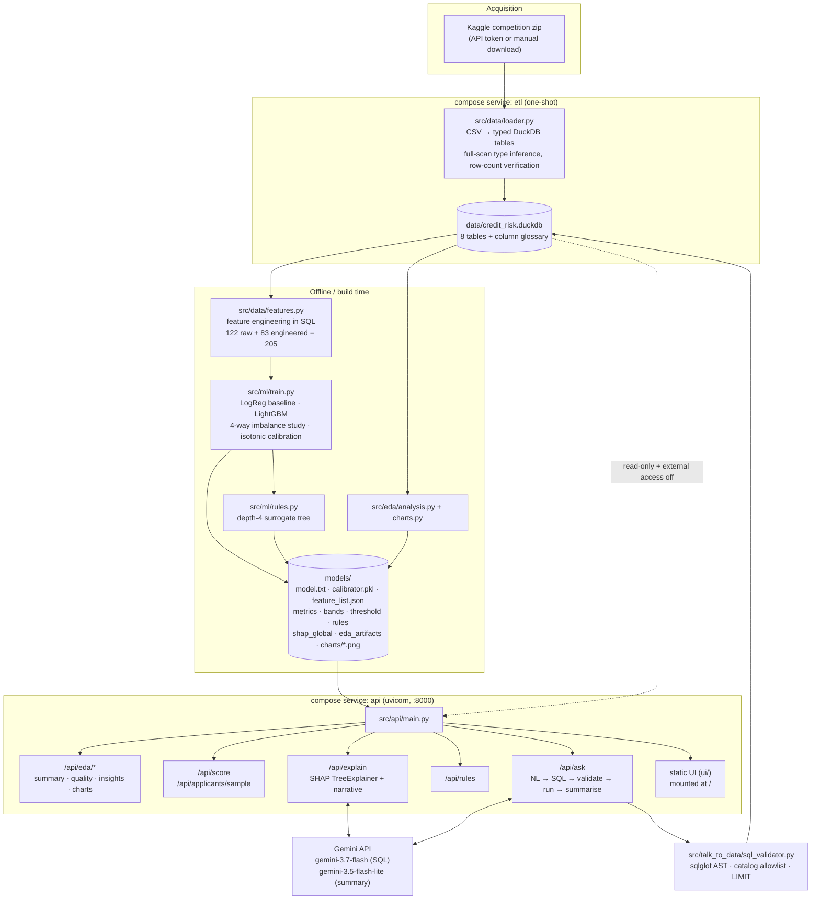

# Credit Risk Intelligence Platform

A credit-default scoring platform built on the [Home Credit Default Risk](https://www.kaggle.com/competitions/home-credit-default-risk) dataset (307,511 labelled applications, 58.5M rows across 8 tables). It ingests the raw Kaggle CSVs into DuckDB, engineers 205 features entirely in SQL, trains a calibrated LightGBM model, and serves the result through a FastAPI app: score an applicant, get a SHAP-grounded explanation of why, read the policy rules distilled out of the model, and ask questions of the underlying data in plain English.

The natural-language layer sends questions to Gemini, which writes SQL that is parsed and checked against the live database catalog before it is allowed to run against a read-only connection. Every number in this README, in `docs/MODEL_CARD.md` and in `docs/EDA_FINDINGS.md` comes from a committed artifact under `models/`, produced by a real training run against the real dataset.

**Live demo:** _(deployment pending — URL to be added here once the Render service is up)_

---

## Architecture



The two compose services share one image. `etl` runs `python -m src.data.loader` once and exits; `api` runs uvicorn and does not wait on it (see the "artifacts are pre-committed" note below for why that is safe).

---

## Setup and run

### Path 1 — Docker (primary)

```bash
git clone <this-repo> && cd credit-risk-intelligence
cp .env.example .env
```

Open `.env` and fill in two things.

**1. `GOOGLE_API_KEY`** — required for the "Ask the data" chatbot and for the plain-English explanation sentence. Get one free at <https://aistudio.google.com/apikey>. Without it the app still starts and everything except those two features works; they report that a key is needed.

**2. `KAGGLE_API_TOKEN`** — required only if you want the ETL to download the dataset for you. Generate one at <https://www.kaggle.com/settings/api> ("Generate New Token").

> **Read this before you generate the Kaggle token.** Home Credit Default Risk is a *competition* dataset. You must accept its rules once, in a browser, at
> <https://www.kaggle.com/competitions/home-credit-default-risk/rules>
> A perfectly valid API token returns a bare **403** until you do, with no message distinguishing "you haven't accepted the rules" from "your token is bad". We hit this for real during the build; `src/data/acquire.py` now catches that status code and prints an actionable message instead of a stack trace.

Then:

```bash
docker compose up
```

First run builds the image, `etl` ingests the dataset (~78s and a 2.37 GB DuckDB file on the full dataset, once the CSVs are on disk), and `api` comes up on <http://localhost:8000>. The API answers `/health` immediately, before the ETL finishes.

**Manual-zip fallback.** If you would rather click "Download All" on Kaggle than manage a token, drop the file at `data/home-credit-default-risk.zip` and leave `KAGGLE_API_TOKEN` blank. `src/data/acquire.py` tries three routes in order: already-extracted CSVs in `data/raw/`, then that zip, then the Kaggle API.

**Smaller machines.** Set `DATA_MODE=lite` in `.env` to ingest a TARGET-stratified sample instead of all 55M rows (the sample preserves the 8.1% default rate and referential integrity across child tables, so the app works — the numbers are just sampled). Also tune `DUCKDB_MEMORY_LIMIT` to roughly 60% of available RAM.

### Path 2 — Local Python

Python 3.12.

```bash
python -m venv .venv && source .venv/bin/activate
pip install -r requirements.txt          # or requirements-dev.txt to run tests
cp .env.example .env                     # fill in keys as above
```

Paths in `.env.example` default to the container layout (`/app/...`); `src/utils/config.py` rewrites them relative to the repo root when it detects it is running outside Docker, so the same file works in both places.

```bash
# Optional — only needed for real-applicant lookup and the chatbot:
python -m src.data.loader                # build data/credit_risk.duckdb

# Optional — the committed artifacts already cover this:
python -m src.ml.train                   # ~4.5 min on 307k rows, 14 cores
python -m src.ml.rules
python scripts/build_eda_artifacts.py

# Serve:
uvicorn src.api.main:app --host 0.0.0.0 --port 8000
```

One process serves both the JSON API under `/api/*` and the static UI at `/`. No separate frontend server, no CORS to configure.

---

## Important: most of the app works without the dataset

The trained model and every derived artifact are **committed to the repo** (`.gitignore` negates them explicitly). On a fresh clone, with no Kaggle credentials and no ETL run at all:

| Feature | Works without the dataset? | Needs |
|---|---|---|
| Portfolio / EDA section | ✅ | `models/eda_artifacts.json` + `models/charts/*.png` |
| Score a hand-entered applicant | ✅ | `model.txt`, `calibrator.pkl`, `feature_list.json`, `bands.json` |
| SHAP explanation + factor chart | ✅ | the booster + `shap_global.json` |
| Policy rules | ✅ | `models/rules.json` |
| Plain-English narrative on an explanation | ✅ with a Gemini key | `GOOGLE_API_KEY` |
| Pick a **real applicant by ID** | ❌ | the DuckDB database (ETL) |
| Ask the data (chatbot) | ❌ | the DuckDB database **and** `GOOGLE_API_KEY` |

Those last two return a clear 503 rather than crashing the app, and start working on the next request once `etl` finishes — no restart. This is why the compose file deliberately does not make `api` depend on `etl` succeeding.

### Readiness is a marker, not file existence

`database_exists()` checks for a `.ready` marker written only after a full, row-count-verified ETL run — not for the `.duckdb` file. DuckDB creates that file the instant a connection opens, long before the tables are populated. Checking the file was a real bug: a request arriving during a rebuild got a raw 500 (`CatalogException: bureau_balance does not exist`) because readiness had already reported true. The marker is cleared at the start of every build and written at the end, so mid-build the honest answer is "not ready" — and an interrupted build no longer looks complete to the next run.

---

## Deploying to Render

`render.yaml` is a Blueprint for a **single** web service. Push the repo, then open:

```
https://dashboard.render.com/blueprint/new?repo=https://github.com/samuelshine/credit-risk-intelligence
```

Fill in `GOOGLE_API_KEY` and `KAGGLE_API_TOKEN` (both `sync: false`) and apply.

One service rather than the two compose runs, because Render attaches a persistent disk to a single instance and does not mount it during build — there is no companion container that could run the ETL against the same disk. So the API ingests for itself: `AUTO_INGEST_ON_STARTUP=true` makes it build the database in a background **thread** on first boot (a thread, not an asyncio task — `build_database()` is blocking DuckDB work that would stall every request on the event loop). `/health` answers immediately throughout, which is what stops Render's health check from killing the container mid-ingest.

That flag defaults to `false` so it never races compose's dedicated `etl` service.

**Sizing, stated plainly:** this needs a paid `standard` instance (2 GB RAM) plus a 15 GB disk. The free and starter tiers are 512 MB and will be OOM-killed during ingestion, and free instances have no persistent disk at all, so the database would be rebuilt from scratch on every restart. First boot takes 4–8 minutes (2.7 GB download, then ~80 s ingest). If you would rather not pay for a hosted instance, `docker compose up` gives an identical app locally, and the committed artifacts mean a reviewer can exercise most of it with no dataset and no cost.

Full details, trade-offs and the local paths: **[docs/DEPLOYMENT.md](docs/DEPLOYMENT.md)**.

---

## Model selection and class imbalance

### Why LightGBM

At ~307k rows and 205 mixed numeric/categorical features, gradient-boosted trees are the strong tabular baseline: no GPU, minutes to train, and two properties that matter for this specific dataset — native NaN handling (missingness here is informative, not random; see `docs/EDA_FINDINGS.md`) and native categorical support, which avoids a 58-level one-hot expansion of `ORGANIZATION_TYPE`.

Measured against a transparent linear reference on the identical feature set:

| Model | Mean PR-AUC (5-fold CV) |
|---|---:|
| Logistic Regression (baseline) | 0.25183 |
| **LightGBM (shipped)** | **0.27901** |

**+10.8% relative.** That isolates what model choice buys, separately from what feature engineering buys.

### The imbalance study

The class ratio is 11.4:1 (8.073% positive). Accuracy is meaningless here — always predicting "no default" scores ~92% — so selection is on **PR-AUC**. Four strategies were run on the **same** 5-fold CV splits:

| Strategy | Mean PR-AUC | Mean ROC-AUC | Mean Brier |
|---|---:|---:|---:|
| **None (shipped)** | **0.27901** | 0.78587 | 0.0660 |
| Random undersampling | 0.27253 | 0.78177 | 0.18842 |
| SMOTE | 0.24916 | 0.76885 | 0.06751 |
| `scale_pos_weight` (≈11.4) | 0.20000 | 0.73299 | 0.07329 |

**None of the three standard fixes beat training on the data as-is.** Stating that plainly because it cuts against the reflex that imbalance always needs correcting:

- `scale_pos_weight`, the fix most people reach for first, is the **worst** arm here — it loses 28% of the baseline's PR-AUC and 5 points of ROC-AUC. Reweighting changed ranking quality outright, not just calibration.
- Undersampling nearly matches "none" on ranking but **wrecks calibration**: Brier 0.18842 against 0.0660, almost 3x worse. Throwing away 90% of the majority class destroys the model's sense of how *rare* a default is, so its raw probabilities come out badly overconfident. If the output has to be a probability rather than a rank, that is disqualifying.
- SMOTE loses on both axes.

LightGBM's own tree building already handles skewed leaf populations well enough that none of these interventions add ranking power, and each costs something. The shipped model uses **no explicit imbalance handling**, and `models/imbalance_comparison.json` (full per-fold scores) is the evidence for that, not a rule of thumb.

Isotonic calibration is still applied for correctness, fit on the untouched holdout via `CalibratedClassifierCV(FrozenEstimator(model))` — the base model is never refit or otherwise exposed to the holdout. Brier improves from 0.0656 raw to 0.06537 calibrated: a small fix, consistent with "none" already producing well-behaved probabilities.

---

## Evaluation and results

Holdout, n = 61,503, 80/20 stratified split, untouched by training, imbalance handling, or calibration.

| Metric | Value |
|---|---:|
| ROC-AUC | 0.78989 |
| PR-AUC | 0.27939 |
| KS statistic | 0.44141 |
| Brier (calibrated) | 0.06537 |
| Brier (raw) | 0.0656 |

KS is included because it is the number credit-risk teams have judged scorecards on for decades, and it reads directly: how cleanly the score separates goods from bads.

**Confusion matrix at the operating threshold (0.0935):**

| | Predicted: repay | Predicted: default |
|---|---:|---:|
| **Actual: repay** | 43,181 (TN) | 13,357 (FP) |
| **Actual: default** | 1,624 (FN) | 3,341 (TP) |

Precision 20.0%, recall 67.3%.

**The threshold is a policy choice, and it is stated as one.** It is set by minimising expected cost, not by a 0.5 cutoff (meaningless at an 8% base rate) and not by F1 (which treats both error types as equally expensive, which they are not for a lender). The **asserted** assumption is that a missed default costs **10x** a false positive (`fn_cost=10, fp_cost=1` in `src/ml/train.py`). Under that assumption the cost-minimising threshold is 0.0935 — far below 0.5, which is exactly what deliberately expensive false negatives should produce. Change the ratio and rerun `python -m src.ml.train` and the threshold moves. A deploying lender would supply real economics (average loan size, cost of manual review, recovery rate); this ratio is a placeholder for those.

**Risk bands**, cut from the calibrated holdout score distribution rather than from round-number probabilities:

| Band | Population share | Score threshold | Observed default rate | Lift over base |
|---|---:|---:|---:|---:|
| **High** | 10% | ≥ 0.1878 | 29.9% | 3.7x |
| **Medium** | 40% | ≥ 0.0449 | 9.7% | 1.2x |
| **Low** | 50% | < 0.0449 | 2.4% | 0.3x |

**Lift** — the table a credit officer actually reads:

| Decile (riskiest first) | Default rate | Lift | Cumulative defaulters caught |
|---:|---:|---:|---:|
| 1 | 29.9% | 3.7x | 37.0% |
| 2 | 16.6% | 2.1x | 57.6% |
| 3 | 10.3% | 1.3x | **70.4%** |
| 4 | 7.1% | 0.9x | 79.3% |
| 5 | 4.7% | 0.6x | 85.1% |
| 6–10 | 4.2% → 0.9% | 0.5x → 0.1x | 90.3% → 100% |

**Reviewing the riskiest 30% of applicants catches 70.4% of all eventual defaulters.** That is the concrete operational number behind "prioritise manual review by risk score."

---

## Prompt engineering and token optimization

Full write-up with templates and per-call token tables: `docs/PROMPTS.md` (in progress; the measured figures below are what it carries). Prompts themselves live in `src/talk_to_data/prompt_templates.py` — versioned as source code, with `PROMPT_VERSION` (`v1.0.0`) recorded on every answer the API returns, so any transcript in the docs traces back to the exact prompt that produced it.

**Per-question schema-card pruning.** Pasting all 7 tables and ~220 columns into every prompt costs roughly 4,000 tokens before the user has said anything, and it *hurts* accuracy by burying the relevant column among two hundred irrelevant ones. `schema_card.py` builds the card in two tiers: Tier 1 (every table's name, row count, purpose, join keys) always included, Tier 2 (full column detail) only for the tables and columns the question plausibly touches. Measured effect: **~50% fewer tokens** on a typical question; `tests/test_schema_card.py` asserts the pruned card stays under 70% of the full card as a regression floor. Selection is lexical and deterministic through a curated `DOMAIN_SYNONYMS` map rather than embeddings — no model call, no vector store, and reproducible for an evaluator. When the selector is unsure it includes rather than drops: a missing column produces a wrong answer, a spare one costs a few tokens.

**Similarity-selected few-shots.** Ten worked examples exist; `select_examples()` scores them on tag hits and shared question vocabulary and sends the top 3. **874 → 204 tokens.** Deterministic, and it falls back to the first three (the general rate and group-by patterns) when nothing scores.

**Two models, split by job.** `gemini-3.7-flash` writes the SQL, which is the structured-reasoning half; `gemini-3.5-flash-lite` only turns already-computed rows into a sentence. Both pinned to stable IDs, not floating `-latest` aliases, so a re-run reproduces the documented results.

**Markdown, not JSON, for result rows.** Rows go to the summarising model as a markdown table. JSON re-states every column name on every row; markdown states them once in the header.

**Thinking is minimised, not disabled — and that distinction is real.** Gemini 3.x rejects `thinking_budget=0` (the Gemini 2.x "off" switch) with `400 INVALID_ARGUMENT`. There is no full off on the 3.x line, only `thinking_level` ∈ {low, medium, high}. Both calls use `low`, which still cost 58–77 thought tokens on a one-word prompt in live testing. Rather than claim thinking is off, the cost is measured and budgeted for. It bit us for real: the `/api/explain` narrative was silently truncated mid-sentence because thinking consumed 286 of a 300-token budget, and thinking cost for that prompt shape turned out to *scale with reasoning demanded* (up to ~1,040 thought tokens when weighing several SHAP factors into one constrained explanation), not to be a small fixed overhead. Fixed by budgeting 1,500 tokens with real headroom, not the observed minimum.

Temperature 0 and a fixed seed throughout — a changing answer would make the documented transcripts worthless.

---

## Hallucination control

Three layers, and the design is explicit that the prompt is *not* one of the security ones — a language model can always be talked into emitting something unintended.

**Layer 1 — the prompt (accuracy, not security).** The model sees only columns rendered from the live catalog, is told to use nothing else, and is given `CANNOT_ANSWER:` as an explicit, legitimate way to refuse. That matters: without a cheap refusal path, a model asked an unanswerable question will invent a plausible query against invented columns, because producing *something* is the path of least resistance.

**Layer 2 — `sql_validator.py`, AST validation via sqlglot, never regex.** A regex over SQL text is defeated by comments, string literals, whitespace and casing, and gives no way to tell a column reference from a column name inside a string. The parsed tree is checked for:

1. It parses at all, in the DuckDB dialect.
2. Exactly one statement — no `SELECT 1; DROP TABLE bureau`.
3. It is a read: `SELECT`, or `WITH` wrapping one.
4. No write, DDL, or administrative node anywhere in the tree.
5. **No filesystem or network function.** This is the check that carries the most weight: `SELECT * FROM read_csv('/etc/passwd')` is a perfectly ordinary `SELECT` node, and only a function-name denylist distinguishes it.
6. Every table exists and is on the allowlist, checked against the live catalog.
7. Every column exists on the table it is attributed to, resolved through CTEs, subqueries and aliases.
8. A row limit is present — injected or clamped to `MAX_SQL_ROWS`.

**Layer 3 — the connection itself.** LLM-generated SQL runs on a DuckDB handle opened read-only **and** with `enable_external_access=false`. The second flag is what actually does the work, and this was measured on DuckDB 1.5.5 rather than assumed:

| Operation | read-only alone | read-only + `enable_external_access=false` |
|---|---|---|
| `read_csv('/etc/passwd')` | **allowed** | `PermissionException` |
| `glob('/etc/*')` | **allowed** | `PermissionException` |
| `COPY … TO '/tmp/out.csv'` | **allowed** | `PermissionException` |
| `ATTACH` another database | **allowed** | `PermissionException` |

Read-only protects the *database*, not the filesystem. `enable_external_access` is a locked setting once the database is open, so a generated query cannot re-enable it and escalate its own privileges.

Layer 3 alone would be enough to keep the system *safe*, but not *honest* — a query against a hallucinated column would reach the engine and come back as an opaque "column not found". Catching it at layer 2 means the error can be named, the real column suggested, and a specific correction handed back.

**One repair attempt, then failure.** A rejected query gets exactly one correction round with the specific validation errors. A second failure is reported as a failure, not retried until something happens to pass.

**Answers come from returned rows only.** The summarising model sees the result rows and nothing else — never the database, and (after a real bug) not even the SQL text. It had been hallucinating "truncated to 500 rows" on single-row aggregate queries, inferring truncation from the `LIMIT 500` the validator had injected into SQL it did not need to see. Dropping the SQL from the summary prompt and stating completeness in one explicit sentence fixed it.

Every stage is recorded on the `Answer` object — the SQL, validation errors, whether a repair happened, the row count, token usage — and the UI shows that trail. That is what makes an answer auditable rather than merely asserted.

---

## Business rules

`src/ml/rules.py` fits a depth-4 `DecisionTreeRegressor` to approximate the **calibrated score, not the label**. That distinction is load-bearing: a classifier trained on `TARGET` would learn to mimic "guess the most likely class" and lose exactly the risk gradation the score exists to capture. Predicting the score keeps the tree honest about *ranking* risk, which is what a policy rule needs.

Each root-to-leaf path becomes one IF-THEN sentence. Every number attached to it — population share, observed default rate, lift — is measured **directly against `TARGET`** for the applicants who actually fall in that leaf, not read off the tree's own prediction.

16 rules, spanning 36.3% down to 2.6% observed default rate. Three real ones from `models/rules.json`:

> **IF** `Ext source mean <= 0.395` **AND** `Ext source mean <= 0.253` **AND** `Ext source min <= 0.121` **AND** `Credit goods ratio > 1.16`
> **THEN** 1.5% of applicants (4,554), observed default rate **36.3%** (4.5x base rate)

> **IF** `Ext source mean <= 0.395` **AND** `Ext source mean > 0.253` **AND** `Prev refusal rate > 0.311` **AND** `Credit goods ratio > 1.16`
> **THEN** 1.3% of applicants (4,046), observed default rate **23.1%** (2.9x base rate)

> **IF** `Ext source mean > 0.395` **AND** `Ext source mean > 0.517` **AND** `Ext source max > 0.686` **AND** `Ext source mean > 0.564`
> **THEN** 27.7% of applicants (85,106), observed default rate **2.6%** (0.3x base rate)

**Fidelity, reported rather than assumed:**

| | Value |
|---|---:|
| R² vs. the calibrated score | 0.4885 |
| Surrogate ROC-AUC vs. actual `TARGET` | 0.7207 |
| Full model ROC-AUC, same training data | 0.8766 |

Both ROC-AUCs are measured on training data the surrogate saw, so the comparison flatters both; the holdout 0.78989 above is the fair number for the full model. The surrogate captures real, useful structure and is meaningfully simpler than the model it approximates. That is the honest framing of "here is a readable four-question checklist" — not a claim that the checklist matches the model.

---

## Sample outputs

### Chatbot

Both captured against the live Gemini API and the real ingested database.

**Q: "What is the overall default rate?"**

```sql
SELECT COUNT(*) AS applications,
       SUM(TARGET) AS defaults,
       AVG(TARGET) AS default_rate
FROM application_train
LIMIT 500
```

> The overall default rate is 8.1%. This is out of a total of 307,511 applications, which resulted in 24,825 defaults.

1,971 tokens for the round trip. The `LIMIT 500` is the validator's injected ceiling, not something the model wrote.

**Q: "What is the average income of applicants who defaulted?"**

> The average income of applicants who defaulted is $165,612. This figure is calculated from a total of 24,825 defaulted applications.

2,029 tokens. Zero hallucinated columns and zero repair attempts were needed across the live test runs.

### Explanation

`/api/explain` for applicant **213106** returns a calibrated score of **12.1%**, placing them in the **Medium** band (portfolio base rate 8.07%), alongside the signed top-6 SHAP contributions and a 2–4 sentence narrative generated from those contributions only.

Two things the explanation is careful about, both of which are easy to get backwards. SHAP explains the model's **raw log-odds** output, not the calibrated probability shown to the user — calibration is a monotone remap fit afterwards with no per-feature decomposition. Contributions are therefore always phrased directionally ("pushed the risk up/down"), never as an exact slice of the displayed percentage. And the "portfolio average" the narrative compares against is the real base rate threaded through from `RiskModel.base_rate`, not SHAP's `base_value` (a log-odds figure around −2.96, which rendered as `−296.1%` before that bug was found).

---

## Testing

```bash
pip install -r requirements-dev.txt

# 144 tests, fully offline — no network, no API key:
PYTHONPATH=. python -m pytest tests/ -q --deselect tests/test_gemini_live.py

# 5 live contract tests against the real Gemini API (needs GOOGLE_API_KEY):
PYTHONPATH=. python -m pytest tests/test_gemini_live.py -v
```

| File | Tests | What it covers |
|---|---:|---|
| `test_sql_validator.py` | 36 | **Adversarial:** SQL injection, filesystem escape (`read_csv`, `glob`, `COPY TO`), hallucinated columns, multi-statement, DDL, limit injection |
| `test_api.py` | 20 | TestClient HTTP: routing, validation, every degraded-mode path (no DB / no model / no key), real trained-model success paths |
| `test_schema_card.py` | 18 | Pruning correctness, token reduction floor, domain-prior weighting |
| `test_analysis.py` | 12 | Exact-value EDA assertions + 2 regression tests for real bugs (backwards lift ratio, false monotonicity assumption) |
| `test_nl_to_sql.py` | 11 | Repair loop, refusal path, grounding, degraded mode |
| `test_query_runner.py` | 8 | Row limits, watchdog timeout, markdown rendering |
| `test_predict.py` | 8 | Artifact loading, band assignment, manual-entry scoring, signal recovery |
| `test_rules.py` | 8 | Exact-value fidelity and lift assertions against a known-answer fixture |
| `test_evaluate.py` | 8 | KS, lift, confusion matrix against constructed cases with known answers |
| `test_explain.py` | 7 | SHAP grounding (narrative never references anything outside the computed values), signal recovery, LLM-unavailable degradation |
| `test_charts.py` | 4 | Chart rendering |
| `test_features.py` | 3 | SQL determinism regression test, `load_features` contract |
| `test_gemini_live.py` | 5 | Live API contract checks; skipped without a key |

The adversarial validator suite is the one worth singling out: it is the layer that decides whether a model-written query gets to touch the database, and it is tested against attacks rather than only against well-formed queries.

`tests/conftest_ml.py` trains and saves a small but genuinely real LightGBM + isotonic model in milliseconds, through the exact same save code paths `train.py` uses, so `predict.py`/`explain.py`/`rules.py` are tested against real artifacts without needing the ~4.5 minute full training run.

---

## Known limitations and possible improvements

**Model and fairness**

- **`CODE_GENDER` is the model's #2 global feature by mean |SHAP|** (0.10449), behind only `EXT_SOURCE_MEAN` (0.40429) and ahead of income, credit amount and employment history. Using a protected attribute as a predictive feature raises real fair-lending concerns — disparate treatment and disparate impact review would be required before any production use. This platform is a technical demonstration, not a compliance-reviewed scoring system. A real deployment would need to exclude protected attributes or apply an explicit fairness constraint and audit.
- **The imbalance comparison covered only 4 well-known techniques at default settings.** Cost-sensitive learning, ensemble methods like `BalancedRandomForest`, and per-fold threshold tuning were not explored and might change the "none wins" conclusion.
- **The 10:1 FN:FP cost ratio is asserted, not derived** from real loan economics. Everything downstream of it — the 0.0935 threshold, the precision/recall trade-off — inherits that assumption.
- **Surrogate fidelity is moderate** (R² 0.4885). The rules are a useful, auditable summary, not a substitute for the model in a decision that matters.
- **No temporal validation.** The dataset carries no timestamp usable for out-of-time testing, so the holdout split is random rather than chronological. Nothing here speaks to performance on genuinely future applications.

**Platform**

- **No authentication on the API.** Every route is open. Fine for a local evaluation, not for anything exposed.
- **Single instance only.** DuckDB is a file-based engine and takes a lock on the database; the API cannot be horizontally scaled against the same file as written.
- **Hard dependency on the Gemini API** for the chatbot and the narrative sentence. Both degrade cleanly (the app starts and everything else works without a key), but there is no local fallback model.

**Not finished**

- `notebooks/eda.py` ↔ `notebooks/eda.ipynb` jupytext pairing is **not done**. The same `src/eda/analysis.py` functions are exercised by the API and by 12 tests, so nothing is unverified, but the notebook itself does not exist yet.
- `docs/PROMPTS.md` is not yet committed; the transcripts and token counts it will contain are captured and summarised above.
- `tests/test_config.py`, `test_database.py` and `test_loader.py` do not exist as committed pytest files. Those modules were verified with ad hoc scripts and against the real dataset, but deserve proper regression tests.

---

## Project structure

```
credit-risk-intelligence/
├── src/
│   ├── api/
│   │   ├── main.py              # app factory; /health, static UI mount, degrades with no DB/model/LLM
│   │   ├── schemas.py           # Pydantic request/response models
│   │   └── routes/
│   │       ├── eda.py           # /api/eda/{summary,quality,insights,charts/*} (path-traversal guarded)
│   │       ├── score.py         # /api/score (by id or hand-entered), /api/applicants/sample
│   │       ├── explain.py       # /api/explain — SHAP + narrative; re-scores server-side
│   │       ├── rules.py         # /api/rules
│   │       └── ask.py           # /api/ask — talk-to-data
│   ├── data/
│   │   ├── acquire.py           # 3-route dataset acquisition: extracted / zip / Kaggle API
│   │   ├── database.py          # read-write vs read-only+external-access-off connections
│   │   ├── loader.py            # CSV → typed DuckDB tables; full/lite mode, row-count verification
│   │   └── features.py          # 205 features built in SQL, one LEFT JOIN per child table
│   ├── eda/
│   │   ├── analysis.py          # pure functions, one per insight; the single source for docs + API
│   │   └── charts.py            # matplotlib → models/charts/*.png
│   ├── ml/
│   │   ├── train.py             # baseline, LightGBM, imbalance study, calibration, bands, threshold
│   │   ├── evaluate.py          # ROC/PR-AUC, KS, Brier, lift, calibration curve, confusion matrix
│   │   ├── predict.py           # artifact loading; the only place probability → band lives
│   │   ├── explain.py           # SHAP TreeExplainer global + local, Gemini narrative
│   │   └── rules.py             # depth-4 surrogate tree → IF-THEN rules + fidelity report
│   ├── talk_to_data/
│   │   ├── catalog.py           # live information_schema + Kaggle column glossary
│   │   ├── schema_card.py       # two-tier, per-question pruned schema rendering
│   │   ├── prompt_templates.py  # versioned prompts, 10 few-shots, refusal protocol
│   │   ├── sql_validator.py     # sqlglot AST validation — the security layer that holds
│   │   ├── query_runner.py      # watchdog timeout, markdown result rendering
│   │   └── nl_to_sql.py         # orchestrator: card → SQL → validate → repair → run → summarise
│   ├── llm/gemini.py            # SDK wrapper: token accounting, determinism, reactive model fallback
│   └── utils/                   # config.py (all env reads), logger.py, helpers.py
├── ui/                          # index.html, styles.css, app.js — 5 sections, no build step
├── models/                      # committed artifacts: booster, calibrator, metrics, bands,
│                                #   threshold, rules, shap_global, eda_artifacts, charts/
├── sql/schema.sql               # DDL generated from the live catalog after a real build
├── tests/                       # 144 offline + 5 live; conftest_ml.py trains a real tiny model
├── scripts/
│   ├── download_data.py         # CLI wrapper over src/data/acquire.py
│   └── build_eda_artifacts.py   # regenerates eda_artifacts.json + charts from the database
├── docs/
│   ├── MODEL_CARD.md            # every ML number, traced to a models/*.json artifact
│   ├── EDA_FINDINGS.md          # 8 insights with real figures and chart references
│   ├── DESIGN.md                # UI token system and rationale
│   ├── PROMPTS.md               # prompt templates, measured token optimisation, hallucination control
│   ├── DEPLOYMENT.md            # Docker + Render, sizing, trade-offs
│   ├── TASKS.md                 # full phase-by-phase backlog
│   └── PROGRESS.md              # build state, and the real bugs found along the way
├── documents/
│   └── project_presentation.pdf # the use-case deck with output screenshots
├── notebooks/                   # (jupytext-paired EDA notebook: not done — see limitations)
├── Dockerfile                   # multi-stage, non-root, one image for both compose services
├── docker-compose.yml           # etl (one-shot) + api (uvicorn, healthchecked)
├── render.yaml                  # Render Blueprint: single service, background ingest on first boot
├── .dockerignore                # keeps the 2.7 GB dataset out of the build context
├── .env.example                 # every configurable, documented
└── requirements.txt / requirements-dev.txt
```

---

## Reproducing every number in this README

```bash
python -m src.data.loader            # build the database from the Kaggle CSVs
python scripts/build_eda_artifacts.py
python -m src.ml.train               # ~4.5 min; writes train_summary, metrics, bands,
                                     #   threshold, imbalance_comparison
python -m src.ml.rules               # writes rules.json
```

Every figure above should match `models/train_summary.json`, `models/metrics.json`, `models/bands.json`, `models/threshold.json`, `models/imbalance_comparison.json`, `models/rules.json` and `models/shap_global.json` exactly. `docs/PROGRESS.md` records the 15 real bugs found while building this, including the reproducibility bug where a missing `ORDER BY` in the feature SQL made `train_test_split(random_state=42)` produce a *different* split on every query execution — caught by cross-checking two evaluations that should have agreed and didn't.
