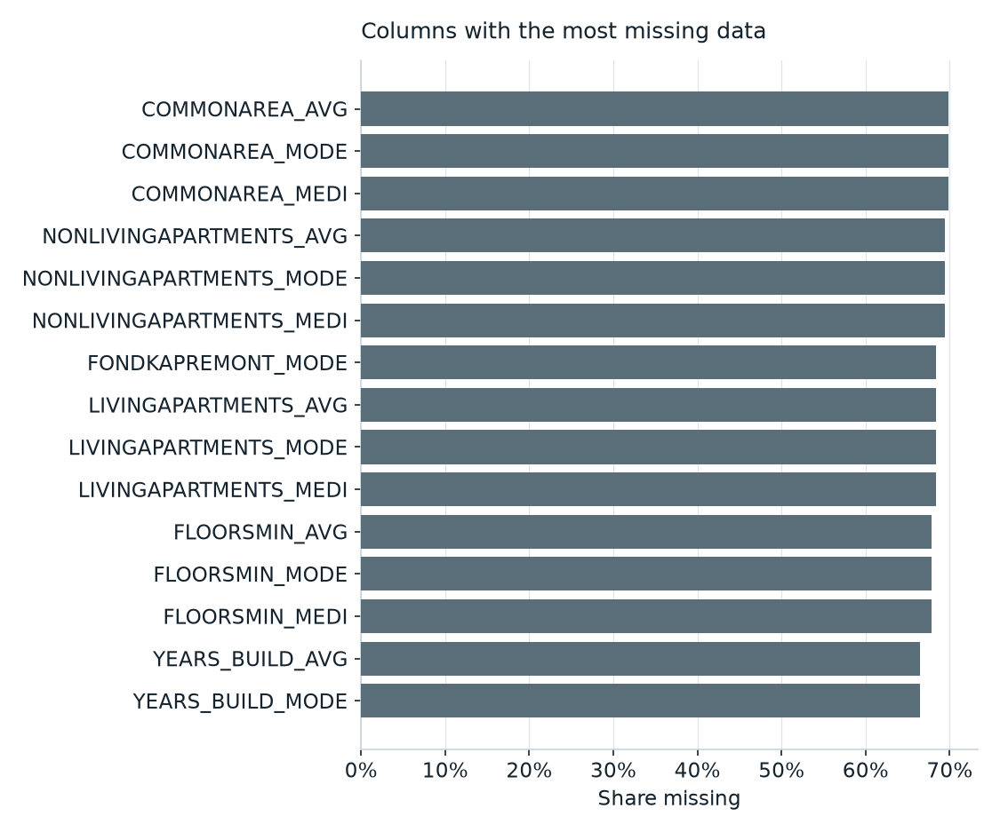
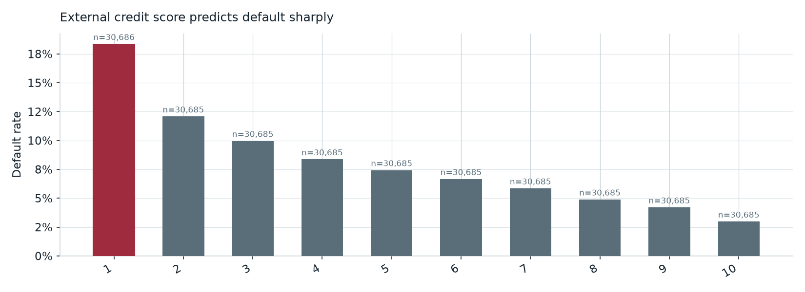
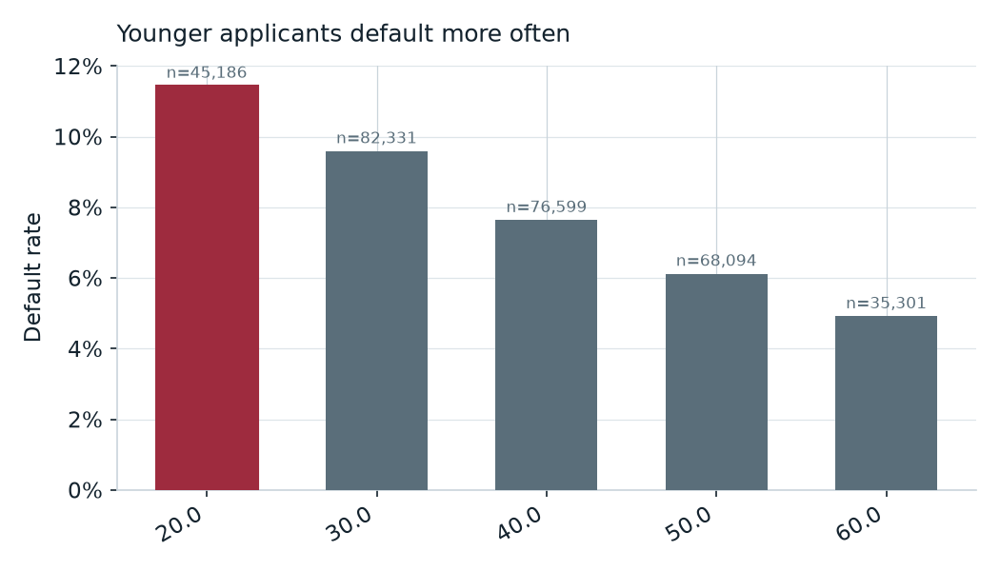
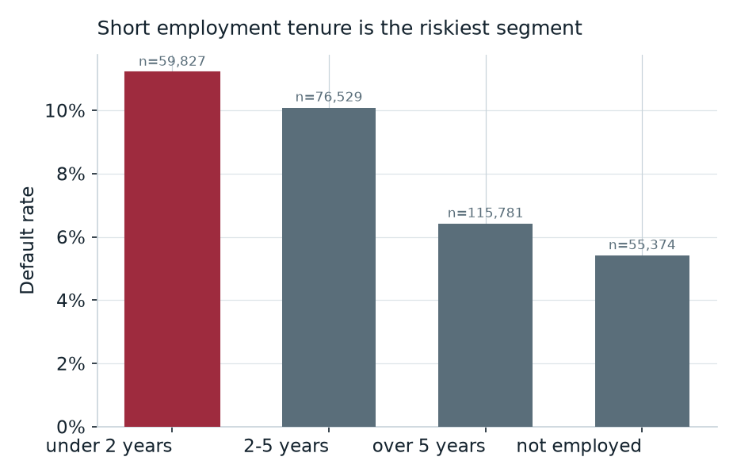
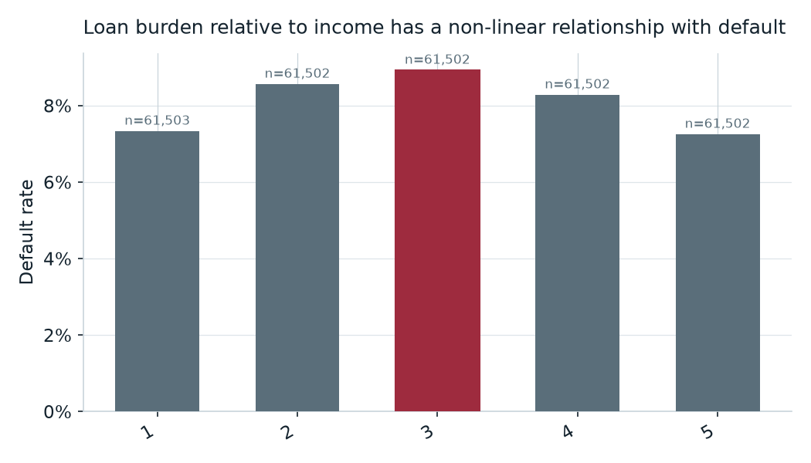
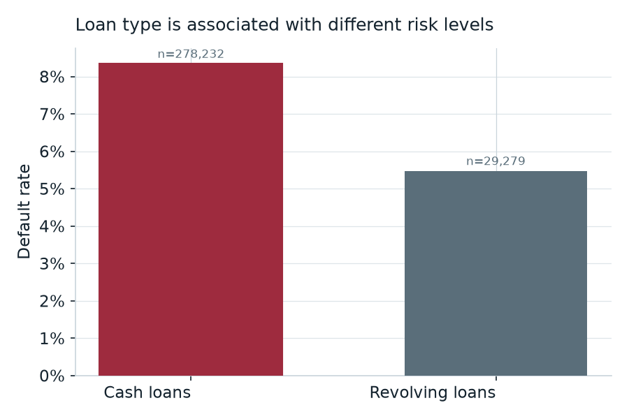
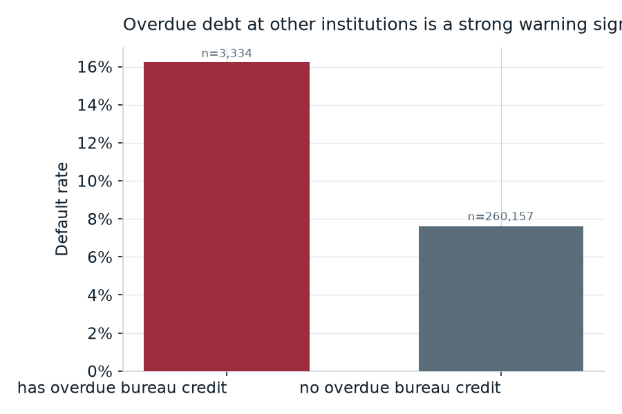
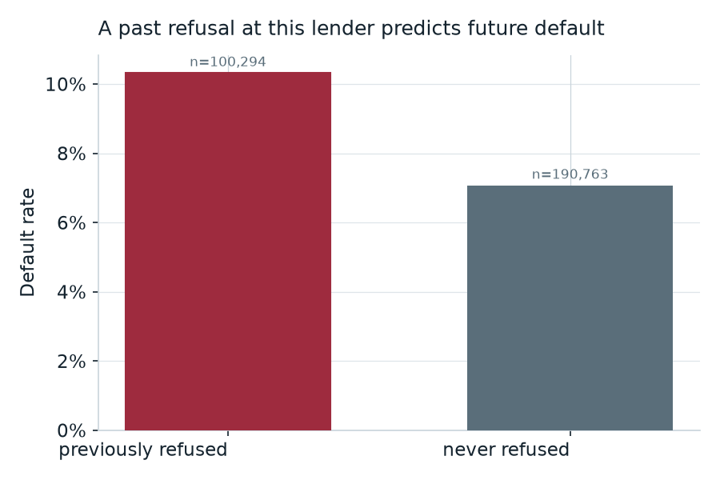
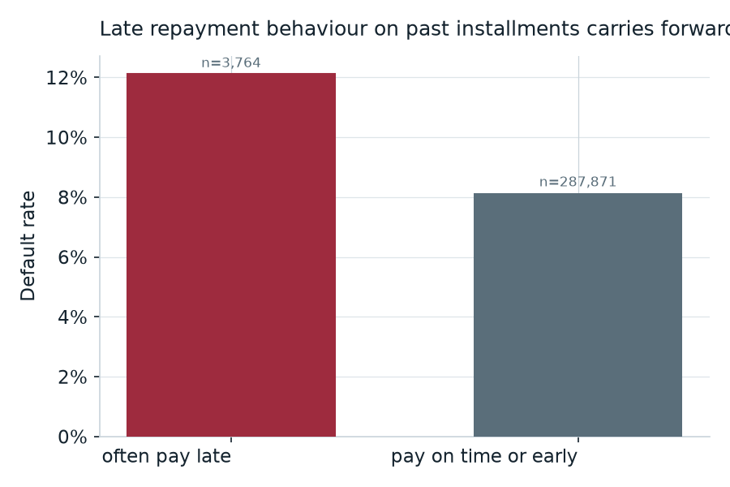

# EDA Findings

Every number here is generated by `src/eda/analysis.py` against the real,
fully-ingested Home Credit Default Risk dataset (`DATA_MODE=full`) — the same
functions the API's EDA section and `notebooks/eda.py` call. Regenerate this
data with `python scripts/build_eda_artifacts.py`; nothing below is typed in
by hand from a different source.

## Dataset summary

| Table | Rows | Columns | What it holds |
|---|---:|---:|---|
| `application_train` | 307,511 | 122 | Loan applications with the `TARGET` default label |
| `application_test` | 48,744 | 121 | Held-out applications (no label) |
| `bureau` | 1,716,428 | 17 | Prior credits at other institutions |
| `bureau_balance` | 27,299,925 | 3 | Monthly status history on those credits |
| `previous_application` | 1,670,214 | 37 | Earlier applications to this lender |
| `installments_payments` | 13,605,401 | 8 | Scheduled vs. actual repayments |
| `credit_card_balance` | 3,840,312 | 23 | Monthly credit-card balances |
| `pos_cash_balance` | 10,001,358 | 8 | Monthly point-of-sale/cash balances |

58,489,893 rows across the 8 data tables (plus the 219-row Kaggle column
glossary, for 58,490,112 total — matching the loader's own build log). Every
count matches Kaggle's published figures exactly, confirmed by the loader's
row-count verification, which runs on every full build.

## Feature categorisation

`application_train`'s 122 columns, grouped by business meaning
(`src/eda/analysis.categorise_column`):

| Category | Columns | Examples |
|---|---:|---|
| Demographic | 9 | `CODE_GENDER`, `CNT_CHILDREN`, `NAME_EDUCATION_TYPE` |
| Financial | 9 | `NAME_CONTRACT_TYPE`, `FLAG_OWN_CAR`, `FLAG_OWN_REALTY` |
| Employment | 3 | `DAYS_EMPLOYED`, `DAYS_REGISTRATION`, `DAYS_ID_PUBLISH` |
| External score | 3 | `EXT_SOURCE_1`, `EXT_SOURCE_2`, `EXT_SOURCE_3` |
| Region | 9 | `REGION_POPULATION_RELATIVE`, `REGION_RATING_CLIENT` |
| Contact flag | 6 | `FLAG_MOBIL`, `FLAG_EMP_PHONE`, `FLAG_WORK_PHONE` |
| Housing detail | 42 | `APARTMENTS_AVG`, `BASEMENTAREA_AVG`, `YEARS_BUILD_MODE` |
| Document flag | 20 | `FLAG_DOCUMENT_2` … `FLAG_DOCUMENT_21` |
| Identifier / target | 2 | `SK_ID_CURR`, `TARGET` |
| Other | 19 | `NAME_TYPE_SUITE`, `WEEKDAY_APPR_PROCESS_START` |

The housing-detail block alone is more than a third of the table's columns —
which is exactly the block the missing-value analysis below flags as mostly
absent.

## Data quality

Six checks, each run against the live database rather than asserted from
memory (`src/eda/analysis.data_quality_findings`):

1. **`DAYS_EMPLOYED` sentinel** — 55,374 rows (**18.0%**) carry the value
   `365243` (1,000 years), used to mean "not employed" rather than a real
   tenure. Left as-is it would dominate any split on employment length as a
   fake outlier; the feature pipeline (`src/data/features.py`) maps it to
   `NULL` with the fact preserved as `FLAG_NOT_EMPLOYED`.
2. **`CODE_GENDER = 'XNA'`** — 4 rows. Negligible in volume but worth naming,
   since an unhandled category would otherwise silently become its own
   one-hot column.
3. **`AMT_INCOME_TOTAL` outlier** — the maximum value is 117,000,000 against a
   median of 147,150 — a **795x** ratio. One applicant, almost certainly a
   data-entry artefact; handled by the model via tree-based splits (immune to
   scale) rather than by deleting the row.
4. **`DAYS_*` sign convention** — checked all 4 non-`DAYS_EMPLOYED` `DAYS_*`
   columns for unexpected positive values (they are documented as negative
   offsets from the application date). None found.
5. **Building-statistics missingness** — the 42-column housing-detail block is
   **48.8%–69.9%** missing per column. This is not random: it is absent for
   applicants whose housing type doesn't have an associated building record
   (e.g. living with parents, renting), so missingness is itself informative
   and is left as `NaN` for LightGBM rather than imputed.
6. **Class imbalance** — the target defaults at **8.07%**, an **11.4:1**
   imbalance. This is the central constraint on Part 3 (Machine Learning) and
   is addressed with a documented four-way comparison in `docs/MODEL_CARD.md`.

Top 10 columns by missingness, all from the same housing-detail block:

| Column | % missing |
|---|---:|
| `COMMONAREA_AVG` / `_MODE` / `_MEDI` | 69.9% |
| `NONLIVINGAPARTMENTS_AVG` / `_MODE` / `_MEDI` | 69.4% |
| `FONDKAPREMONT_MODE` | 68.4% |
| `LIVINGAPARTMENTS_AVG` / `_MODE` / `_MEDI` | 68.4% |



## Business insights

Eight insights, each backed by its own SQL query
(`src/eda/analysis.INSIGHT_FUNCTIONS`) and rendered chart. Headlines below are
composed programmatically from the query result — this file does not restate
a number that isn't traceable back to a specific `insight_*` function.

### 1. External credit score is the single strongest signal in the dataset



The bottom `EXT_SOURCE_2` decile defaults at **18.4%**; the top decile
defaults at **3.0%** — a clean, monotonic **6.2x** risk gap across deciles,
with no dip or reversal anywhere in the curve.

**So what:** `EXT_SOURCE_2` (and its siblings `EXT_SOURCE_1`/`_3`) should
anchor both the model and any manual review process — few raw application
fields separate risk this cleanly on their own.

### 2. Younger applicants default more often



Applicants in their 20s default at **11.4%**, versus **4.9%** for those in
their 60s — a steady decline across every decade in between.

**So what:** age band is a legitimate, zero-cost pre-screening signal, though
credit policy must ensure it informs rather than replaces individual
assessment.

### 3. Short employment tenure is the riskiest segment



Applicants employed under 2 years default most often, at **11.2%** — higher
than the "not employed" sentinel group itself (largely pensioners, who
default rarely).

**So what:** employment tenure captures income stability that raw income
alone misses, and unlike bureau data it's verifiable at the point of
application.

### 4. Loan burden's relationship with default is not a straight line



Applicants were split into five quintiles by credit-to-income ratio. The
**middle** quintile (average ratio 3.3x income) defaults most, at **8.9%** —
higher than the heaviest-burden quintile (average ratio 8.2x income), which
defaults at only **7.3%**.

**So what:** this genuinely surprised the analysis — a naive "flag high
credit-to-income ratio" rule would miss the actual riskiest segment. It's a
concrete argument for the model, which combines this ratio with other
signals, over a hand-written threshold rule for this particular feature.

### 5. Loan product type carries different risk



Cash loan applicants default at **8.3%**, the higher of the two contract
types offered.

**So what:** product-level risk differences justify differentiated pricing or
underwriting thresholds by loan type, independent of applicant-level scoring.

### 6. Overdue debt elsewhere is a strong warning sign



Clients with any overdue balance on a bureau-reported credit default at
**16.2%** — roughly double the **7.6%** rate for clients with no overdue
bureau credit.

**So what:** bureau data surfaces problems invisible to the application form
alone — obligations already in trouble at another lender.

### 7. A past refusal at this lender predicts future default



Clients who were previously refused a loan at Home Credit default at
**10.3%** if later approved, above the portfolio average of 8.07%.

**So what:** internal application history costs nothing to use and should
weigh into how repeat applicants are underwritten.

### 8. Late repayment behaviour on past installments carries forward



Clients whose past installments were, on average, paid more than 5 days after
the due date default at **12.1%** on their current loan.

**So what:** observed repayment behaviour is one of the most directly
actionable signals available — it reflects what a client actually did, not
what they reported.

## Reproducing this document

```bash
python -m src.data.loader              # build the DuckDB database (full mode)
python scripts/build_eda_artifacts.py  # regenerate models/eda_artifacts.json + models/charts/*.png
```

Every figure above should match `models/eda_artifacts.json` exactly; if it
doesn't, this file is stale and needs regenerating, not the other way round.
